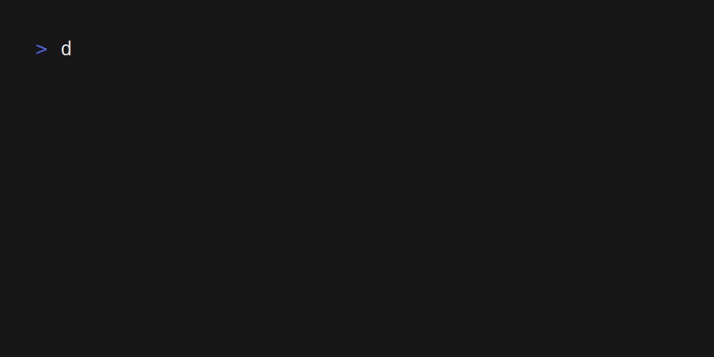

# DisGo
DisGo is CLI music player for streaming music from OneDrive. 

(Gif created using [VHS](https://github.com/charmbracelet/vhs))

## Requirements
- disgo was built on a Debian-based linux distribution. No other configurations have been tested, but likely works where ever the underlying libraries are supported (beep/oto).
- For WSL2 users, in the same way WSL doesn't support GUI applications out of the box, neither does it support audio. Use of a media player in that environment likely requires setting up something like PulseAudio to facilitate audio playback. There appear to be a number of guides on the specifics, but I have not tried any as yet.

## Installation 
- Requires [Go to be installed](https://go.dev/doc/install)
- Make sure your [Go install directory is in your PATH]()
- Download the source and build & install by running ``go install .`` from inside the source

## Usage
1. On first time run, ``.disgo/`` will be created in your home directory to store your library metadata and other configuration data. The browser will also open and prompt to authenticate with OneDrive. Sign in with OneDrive account where your music is stored and accept the permisions.
    - Note: At present, OneDrive will prompt you to authenticate the first time disgo is run after a reboot.
2. Use the ``scan <folder>`` command with a valid folder to find all the music albums in that folder. This should be a folder path relative to your OneDrive root. So if in the root of your OneDrive, you have a ``Music/`` folder, and you want to scan the ``Video Games/`` folder inside, you would run the command ``scan /Music/Video Games/``. This creates a sqlite database of metadata called ``library.db``.
3. Run ``ls`` to list all albums found in ``library.db``.
4. Run ``play <#>`` where # is the number listed against an album as a result of running ``ls``.
5. Run ``help`` to learn about other commands.

## About the project
I have ~100GB audio library stored on my personal OneDrive account. Using [Microsoft Groove](https://en.wikipedia.org/wiki/Groove_Music) on Windows and [Cloudplayer](https://play.google.com/store/apps/details?id=com.doubleTwist.cloudPlayerPro&hl=en_AU&pli=1) on Android, I can stream that audio from OneDrive directly. With no equivalent option for Linux, this is my solution.

### Future Expansion
- Build playlists
- Shuffle playlists
- Save local copies of albums:
  - Choose to download specific albums
  - Option to store any streamed file
- Add local folders to library, independent of OneDrive
- Add other cloud storage providers
- DBUS/MPRIS integration
- UI with [BubbleTea](https://github.com/charmbracelet/bubbletea)
- Support for additional file types
- Other OS support?

## Built using
- [Beep](https://github.com/gopxl/beep)
- SQLite